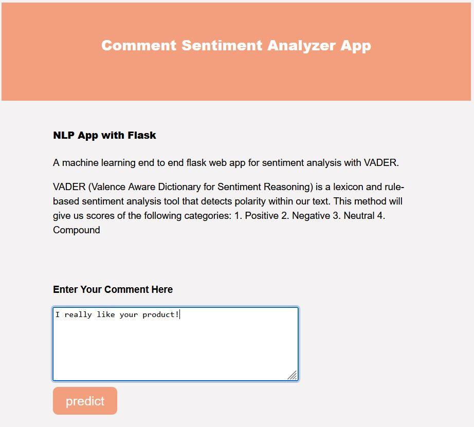
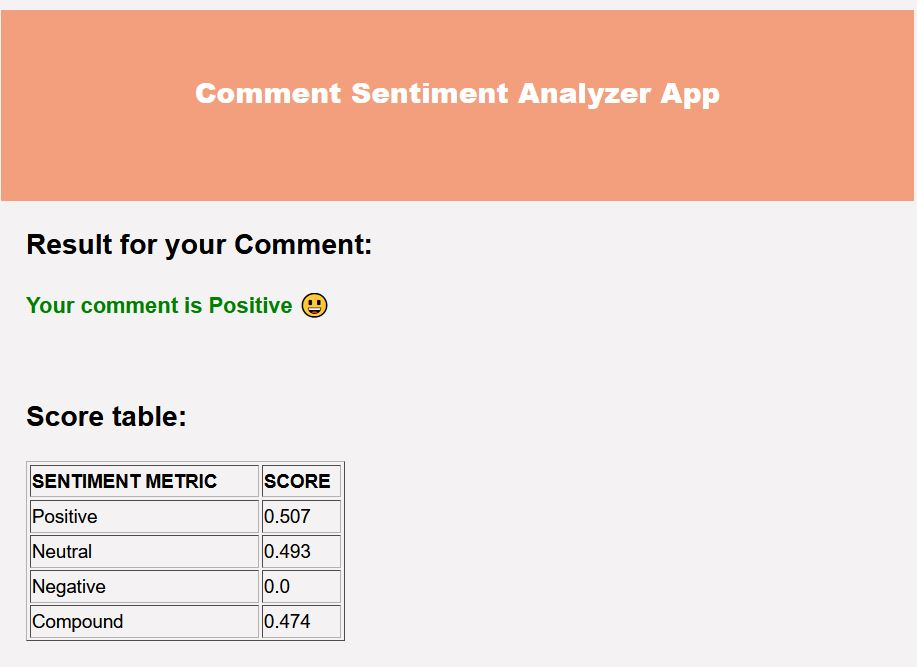

# NLP-Model-Deployment<br />

In this NLP project I created a machine learning end to end flask web app for sentiment analysis with VADER. And finally I deployed my App on Heroku.

Sentiment is defined as the feeling or emotion expressed by the user in the given corpus. VADER (Valence Aware Dictionary for Sentiment Reasoning) is a lexicon and rule-based sentiment analysis tool that detects polarity within our text. This method will give us scores of the following categories: 1. Positive 2. Negative 3. Neutral 4. Compound. 


### To run the application locally:
```
Run: python app.py
```
</br>

 <div class="row">
  <div class="column">
    
  </div>
  <div class="column">
    
  </div>
</div> 
